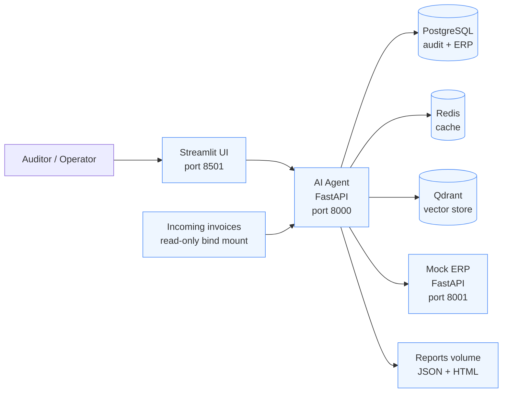

# Architecture

## Runtime flow

1. The monitor sees new files in the incoming directory and records file events.
2. The agent extracts text, detects language, translates, and parses invoice fields.
3. Internal and ERP validators compare invoice numbers, amounts, and PO data.
4. Reports are persisted to PostgreSQL and the reports volume.
5. Retrieval and SQL routing answer auditor questions using Qdrant and relational data.
